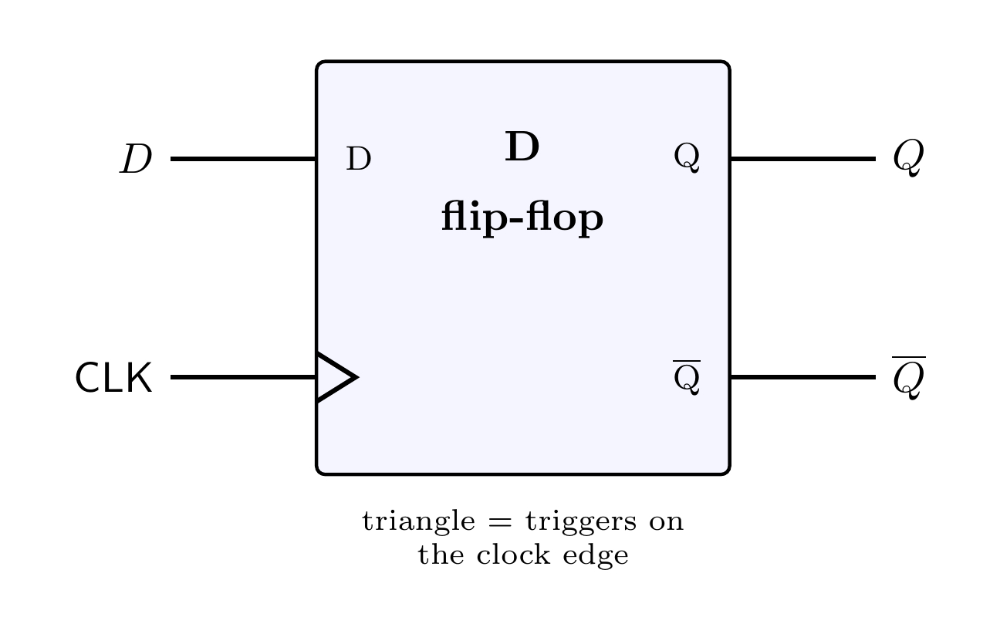
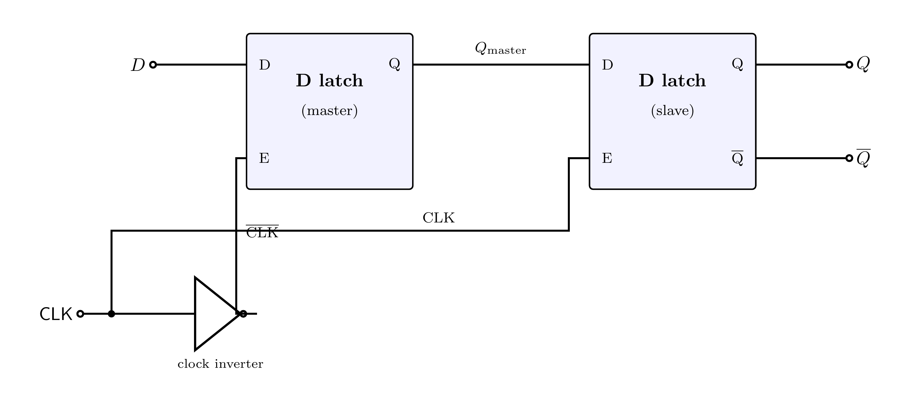
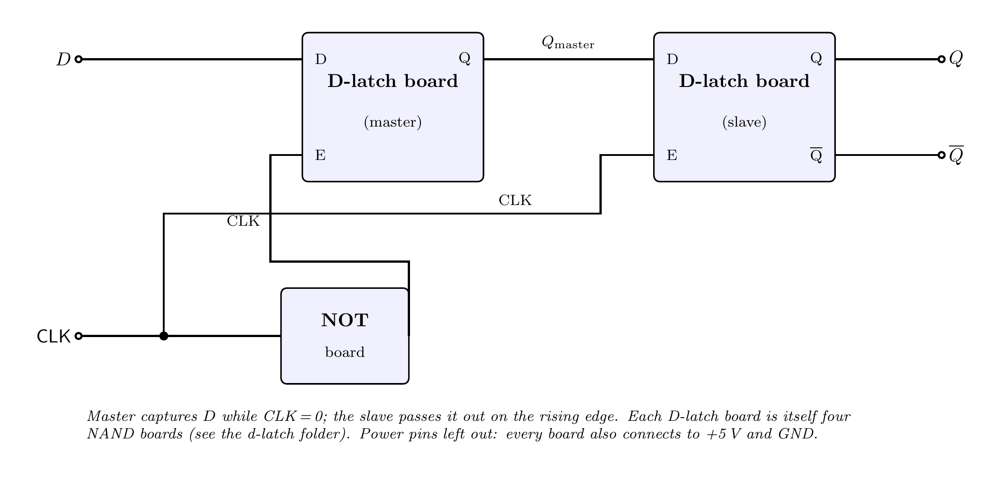

# D Flip-Flop (edge-triggered)

A **flip-flop** is the workhorse memory cell of a CPU — a register is just a row of them. This is
a **D flip-flop**: it stores one bit, and unlike a latch it only updates **on the edge of the
clock** (the instant the clock goes from 0 to 1), then ignores `D` until the next edge.

That "only at the edge" behavior is what lets a whole CPU step forward in lock-step on a clock.

### Symbol

The small triangle on the clock input is the standard mark for **edge-triggered**.



### Truth table

| CLK | `D` | `Q` (next) |
|:---:|:---:|:----------:|
| ↑ (rising edge) | 0 | 0 |
| ↑ (rising edge) | 1 | 1 |
| 0 or 1 (no edge) | × | `Q` (unchanged) |

`Q` copies `D` **only at the rising edge**; the rest of the time it holds.

---

## How it is built

> **Master–slave:** two **D latches in series**, with the clock **inverted** between them.



- **Master latch** — enable = `CLK̄` (inverted clock). It is transparent while `CLK = 0`, so it
  follows `D` and is ready with the latest value.
- **Slave latch** — enable = `CLK`. It is transparent while `CLK = 1`.

How the edge works:

1. While **CLK = 0**: the master follows `D`; the slave is frozen (output unchanged).
2. At the **rising edge (0→1)**: the master **freezes** (capturing whatever `D` was), and at the
   same instant the slave **opens** and passes that captured value to `Q`.
3. While **CLK = 1**: the master is frozen, so even if `D` changes, it can't get through — the
   output stays put.

So `Q` changes **exactly once per clock, on the rising edge** — that's edge triggering. The two
latches "hand off" the bit so it can never race straight through.

---

## Building it on a breadboard

This has **no parts of its own** — it's **two finished D-latch boards** plus **one NOT board**
(the clock inverter):



| Block | Inputs | Output |
|:------|:-------|:-------|
| **NOT board** | CLK | `CLK̄` → master's enable |
| **D-latch board (master)** | `D`, enable = `CLK̄` | `Q_master` → slave's `D` |
| **D-latch board (slave)** | `Q_master`, enable = `CLK` | **Q**, **Q̄** |

All boards share the **same +5 V and GND**. Use an SPDT switch for `D`; for `CLK` use a switch or
a push-button (each press = one clock edge = one update — great for watching it step).

Quick test:
- Set `D = 1`, pulse `CLK` once → `Q` becomes 1 and **stays**.
- Change `D` to 0 with **no** clock pulse → `Q` stays 1 (it only listens at the edge).
- Pulse `CLK` again → now `Q` follows the new `D`. You've just clocked a bit through.

---

## Components

A D flip-flop is two D latches + one NOT, each already built in this project:

| Block | Folder | Transistors |
|:------|:-------|:-----------:|
| D latch ×2 | [`d-latch`](https://github.com/mrmhmdalmalki/d-latch) (= 4 NAND each) | 2 × (8 × 2N3904 + 8 × 2N3906) |
| NOT ×1 | [`not-gate`](https://github.com/mrmhmdalmalki/not-gate) | 1 × 2N3904 + 1 × 2N3906 |

**Total: 17 × 2N3904 + 17 × 2N3906**, plus each board's resistors and LEDs.

---

## Standards and references

- *Master–slave (pulse-triggered) D flip-flop*, Wikipedia ([wikipedia.org](https://en.wikipedia.org/wiki/Flip-flop_(electronics)#Master%E2%80%93slave_pulse-triggered_D_flip-flop)).
- M. M. Mano, *Digital Design*, Pearson (flip-flops and registers).
- T. L. Floyd, *Digital Fundamentals*, Pearson.
- Gate symbols: IEEE Std 91-1984 ([standards.ieee.org](https://standards.ieee.org/ieee/91_91a/241/)).

---

## Regenerating the diagrams

```bash
pdflatex circuit.tex
pdflatex symbol.tex
pdflatex wiring.tex
pdftoppm -png -r 400 circuit.pdf images/circuit
pdftoppm -png -r 400 symbol.pdf  images/symbol
pdftoppm -png -r 400 wiring.pdf  images/wiring
```
